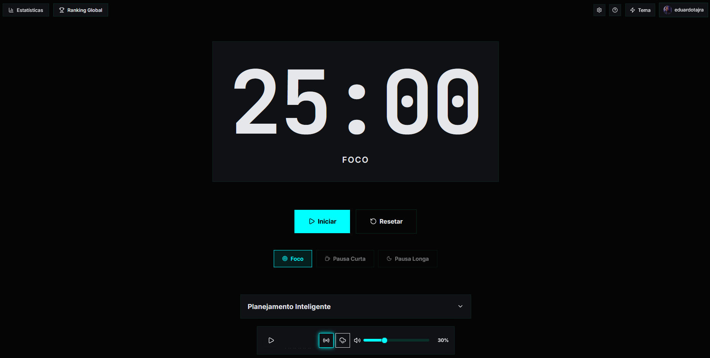

# FocusFM

## A Productivity Suite

[](https://react.dev/)
[](https://www.typescriptlang.org/)
[](https://vitejs.dev/)
[](https://tailwindcss.com/)
[](https://supabase.com/)
[](https://vercel.com/)
[](https://vitest.dev/)
[](https://web.dev/progressive-web-apps/)

---



---

## Sobre o Projeto

FocusFM é mais que um Pomodoro Timer. É um ecossistema completo de produtividade gamificado que combina técnicas comprovadas de foco com tecnologia de ponta para criar uma experiência única de trabalho profundo.

O projeto foi construído sobre três pilares fundamentais que trabalham em sinergia:

### Foco: Timer Adaptativo

Um sistema de Pomodoro inteligente que não apenas conta o tempo, mas aprende com seus padrões. O timer persiste entre sessões, recupera automaticamente o estado ao retornar à aplicação e gerencia ciclos complexos de trabalho e descanso. Com precisão Delta Time para evitar problemas de "tab throttling" do navegador.

### Inteligência: Planejamento com IA

Integração com Google Gemini 3.0 Flash para transformar objetivos vagos em planos de ação concretos. O sistema quebra metas ambiciosas em tarefas acionáveis de 25 minutos, criando um roadmap visual e executável.

### Comunidade: Ranking Realtime

Gamificação multiplayer usando WebSockets do Supabase. Compete com outros usuários em tempo real, acompanha seu progresso no ranking global e desbloqueia conquistas conforme alcança marcos de produtividade.

---

## Tech Stack: O Arsenal

### Frontend

| Tecnologia              | Versão | Propósito                                                 |
| ----------------------- | ------- | ---------------------------------------------------------- |
| **React**         | 19.2    | Biblioteca principal para construção da UI reativa       |
| **TypeScript**    | 5.9     | Tipagem estática e melhor experiência de desenvolvimento |
| **Vite**          | 7.3     | Build tool ultra-rápida com HMR instantâneo              |
| **TailwindCSS**   | 4.1     | Estilização utility-first com suporte a temas dinâmicos |
| **Framer Motion** | 12.27   | Animações fluidas e transições de estado               |

### Data & Backend

| Tecnologia                   | Uso                                                  |
| ---------------------------- | ---------------------------------------------------- |
| **Supabase**           | PostgreSQL como banco de dados principal             |
| **Supabase Auth**      | Autenticação completa (Email, OAuth GitHub/Google) |
| **Supabase Realtime**  | Subscriptions WebSocket para ranking ao vivo         |
| **Row Level Security** | Políticas de segurança no nível do banco          |

### AI Core

| Tecnologia                            | Versão | Uso                                             |
| ------------------------------------- | ------- | ----------------------------------------------- |
| **Vercel AI SDK**               | 6.0     | Abstração para integração com modelos de IA |
| **Google Gemini 3.0 Flash**     | Preview | Modelo de linguagem para geração de tarefas   |
| **Vercel Serverless Functions** | Edge    | Execução serverless das chamadas de IA        |

### Mobile & PWA

| Tecnologia                 | Uso                                                 |
| -------------------------- | --------------------------------------------------- |
| **VitePWA**          | Plugin para transformar em Progressive Web App      |
| **Service Workers**  | Cache inteligente e funcionamento offline           |
| **Web App Manifest** | Instalável como app nativo em dispositivos móveis |

### Quality Assurance

| Tecnologia                      | Versão | Uso                                            |
| ------------------------------- | ------- | ---------------------------------------------- |
| **Vitest**                | 4.0     | Framework de testes unitários                 |
| **React Testing Library** | 16.3    | Testes de componentes focados em comportamento |
| **Happy DOM**             | 20.3    | Ambiente DOM leve para testes                  |
| **ESLint**                | 9.39    | Linting e qualidade de código                 |

**Cobertura de Testes**: O projeto inclui testes unitários para o hook principal `usePomodoro`, cobrindo:

- Estado inicial do timer (25 minutos)
- Início, pausa e reset do timer
- Mudança de tipos de sessão (foco, pausa curta, pausa longa)
- Formatação de tempo
- Persistência no localStorage

**Estrutura Organizada**: O projeto segue uma arquitetura modular com componentes organizados por categoria:

- `components/features/`: Funcionalidades complexas (IA, Ranking, Histórico)
- `components/layout/`: Componentes de layout e modais
- `components/ui/`: Componentes de interface reutilizáveis
- `contexts/`: Gerenciamento de estado global
- `hooks/`: Lógica reutilizável
- `types/`: Definições TypeScript centralizadas
- `utils/`: Funções utilitárias e helpers

### Bibliotecas Auxiliares

| Biblioteca                | Uso                                                  |
| ------------------------- | ---------------------------------------------------- |
| **Recharts**        | Visualização de dados e gráficos de produtividade |
| **Sonner**          | Sistema de notificações toast elegante             |
| **Lucide React**    | Ícones modernos e consistentes                      |
| **date-fns**        | Manipulação e formatação de datas                |
| **uuid**            | Geração de identificadores únicos                 |
| **canvas-confetti** | Animações de celebração para conquistas          |
| **react-easy-crop** | Recorte de foto de perfil com zoom e enquadramento   |

---

## Key Features: Destaques Técnicos

### Timer Pomodoro Inteligente

Sistema completo de gerenciamento de tempo com persistência e recuperação automática:

- **Persistência de Estado**: Timer salvo automaticamente no localStorage e Supabase
- **Persistência em `sessions`**: Inserção automática em `sessions` ao completar ou abandonar; trava (`isSavingRef`) evita gravações duplicadas
- **Precisão Delta Time**: Timer usa timestamps (`endTime`) para evitar problemas de "tab throttling" do navegador
- **Sincronização de Aba**: Revalida e corrige drift quando a aba volta ao foco
- **Recuperação Inteligente**: Ao retornar à aplicação, calcula tempo decorrido automaticamente
- **Ciclos Automáticos**: Alterna entre foco, pausa curta e pausa longa após 4 ciclos
- **Sincronização com Tarefas**: Tarefa atual exibida no timer principal
- **Atualizações Atômicas**: Operações complexas executadas em uma única transação de estado
- **Configurações Personalizadas**: Durações de foco, pausas e auto-start configuráveis por usuário

### Zen Mode: Modo de Foco Profundo

Sistema automático que reduz distrações visuais durante sessões de foco:

- **Ativação Automática**: Ativa quando timer está rodando em modo "Foco"
- **Fade Inteligente**: Elementos não essenciais (tema, ranking, perfil, IA) ficam com opacidade 0.1
- **Hover Restaurador**: Ao passar o mouse, elementos voltam à opacidade normal
- **Proteção Anti-Flickering**: Sistema de debounce e proteção temporal evita piscar visual
- **Hardware Acceleration**: Usa GPU para transições suaves

### Dynamic Themes: Transformação Completa da UI

O sistema de temas vai além de simples mudanças de cor. Cada tema (Lofi, Cyberpunk, Zen) redefine completamente a identidade visual:

- **Variáveis CSS Dinâmicas**: Cores, sombras, bordas e até mesmo o estilo tipográfico mudam instantaneamente
- **Transições Suaves**: Animações de 1.5s garantem mudanças fluidas sem quebras visuais
- **Áudio Temático**: Cada tema possui sua própria identidade sonora (white noise, chuva, ambiente cyberpunk)
- **Persistência**: Preferência de tema salva e restaurada automaticamente
- **Glassmorphism**: Efeitos de vidro translúcido com backdrop-filter para profundidade visual

### Glassmorphism UI: Interface Moderna

Sistema de design com efeitos de vidro translúcido:

- **Backdrop Blur**: Efeito de desfoque de fundo (12px) para profundidade
- **Transparência Adaptativa**: Opacidades ajustadas por tema para melhor contraste
- **Hardware Acceleration**: `will-change` e `transform: translateZ(0)` para performance
- **Aplicado Globalmente**: Timer card, modais, painéis de IA e componentes principais

### Micro-interações: "Juice" na Interface

Animações sutis que tornam a interface mais responsiva e tátil:

- **Botões Interativos**: Scale animations (1.05 no hover, 0.95 no tap) em todos os botões principais
- **Entrada de Modais**: Slide de baixo para cima (y: 20 → 0) com fade
- **Feedback do Timer**: Dois pontos `:` piscam quando timer está pausado
- **Tarefas Completadas**: Line-through animado com mudança de cor
- **Sem Conflitos CSS**: Todas as animações gerenciadas exclusivamente pelo Framer Motion

### AI Task Architect: De Objetivo a Plano Executável

Integração profunda com Google Gemini 3.0 Flash para transformar intenções vagas em planos estruturados:

- **Processamento de Linguagem Natural**: Entende objetivos complexos e ambiciosos
- **Quebra Inteligente**: Divide metas em tarefas acionáveis de 25 minutos
- **Contexto de Produtividade**: Considera padrões Pomodoro e ciclos de foco
- **Interface Conversacional**: Input simples que gera roadmap visual completo
- **Edição Inline**: Clique em qualquer tarefa para editá-la diretamente na lista
- **Exclusão Intuitiva**: Ícone de lixeira aparece no hover para remover tarefas indesejadas
- **Adição Manual**: Botão de adicionar permite criar tarefas manualmente caso a IA tenha esquecido algo
- **Sincronização Imediata**: Tarefas selecionadas aparecem instantaneamente no timer principal
- **Marcação de Conclusão**: Sistema de check/uncheck com animação de line-through

### Realtime Leaderboard: Gamificação Multiplayer

Sistema de ranking que atualiza instantaneamente usando WebSockets:

- **Subscriptions Supabase**: Escuta mudanças na tabela `profiles` em tempo real
- **Debounce Inteligente**: Evita múltiplas atualizações desnecessárias
- **Preservação de Estado**: Mantém dados visíveis durante atualizações em background
- **Destaque do Usuário**: Identificação visual da posição do usuário atual

### RPG System: Sistema de Conquistas

Sistema completo de badges com validação de regras no front-end:

- **Badges Dinâmicos**: Conquistas desbloqueadas baseadas em estatísticas reais
- **Validação em Tempo Real**: Verificação automática ao completar sessões
- **Galeria Visual**: Interface dedicada para visualizar todas as conquistas
- **Progresso Persistente**: Histórico de badges salvo no banco de dados

### Analytics e Histórico de Sessões

Estatísticas detalhadas e histórico persistente:

- **Modal de Histórico (HistoryModal)**: Dashboard com Tempo total de foco, Sessões completas e Balanço (foco vs pausa); timeline agrupada por data (Hoje, Ontem, etc.)
- **Tabela `sessions`**: Persistência de modo (FOCUS, SHORT_BREAK, LONG_BREAK), duração, `completed_at` e status (COMPLETED, ABANDONED)
- **Histórico e Gráficos**: SessionHistory e HistoryChart com totais, filtros (hoje, semana, mês, todos) e visualizações
- **Design Responsivo**: Adapta-se perfeitamente a diferentes tamanhos de tela

### Sistema de Notificações

Feedback visual elegante para ações do usuário:

- **Posicionamento Otimizado**: Notificações no topo central da tela
- **Espaçamento Generoso**: 40px entre notificações para melhor legibilidade
- **Temas Adaptativos**: Estilo das notificações segue o tema ativo
- **Animações Suaves**: Transições de entrada e saída fluidas
- **Múltiplos Tipos**: Sucesso, erro, informação e aviso
- **Notificações Contextuais**: Avisa sobre sessões completadas, ranking atualizado, mínimo de 1 minuto

### Configurações Personalizadas

Sistema completo de preferências do usuário:

- **Durações Customizáveis**: Configure minutos para Foco, Pausa Curta e Pausa Longa
- **Auto-start Inteligente**: Inicie pausas após o foco e pomodoros após as pausas automaticamente (persistido no Supabase)
- **Persistência Multi-camada**: Salvo no localStorage (backup) e Supabase (sincronização)
- **Interface Intuitiva**: Modal com toggles visuais e inputs numéricos
- **Validação**: Limites mínimos e máximos para evitar configurações inválidas

### Autenticação Completa

Sistema robusto de autenticação com múltiplos provedores:

- **Email/Password**: Cadastro e login tradicionais
- **Login com E-mail ou Usuário**: RPC `get_email_by_username` permite entrar com nickname ou e-mail
- **Cadastro simplificado**: Apenas e-mail e senha; confirmação por e-mail (sem auto-login)
- **OAuth**: Integração com GitHub e Google
- **Perfil Personalizado**: Username, avatar e cores customizáveis
- **Recorte de Foto de Perfil**: react-easy-crop com zoom (1x–3x) e forma por tema (redondo em Lofi/Zen, reto em Cyberpunk)
- **Redefinição de Senha**: Fluxo integrado no perfil e página dedicada
- **Sincronização Cloud**: Dados sincronizados entre dispositivos
- **Revalidação de Sessão**: Sincroniza tokens ao voltar à aba

### Guia Interativo: Como Funciona

Modal educativo que explica o ciclo Pomodoro de forma visual e interativa:

- **Timeline Animada**: Passos do ciclo aparecem em sequência com animações staggered
- **Ícones Temáticos**: Representação visual de cada fase (Foco, Pausa Curta, Repetição, Pausa Longa)
- **Tabela de Referência**: Sugestões de atividades para cada tipo de pausa
- **Design Responsivo**: Adapta-se perfeitamente a diferentes tamanhos de tela
- **Integração Temática**: Cores e estilos se adaptam ao tema ativo

### Arquitetura de Estado: Context API

Gerenciamento centralizado do estado do Pomodoro usando React Context:

- **Estado Compartilhado**: Todos os componentes acessam a mesma instância do timer
- **Atualizações Atômicas**: Operações complexas (como definir tipo de sessão e tarefa) são executadas atomicamente
- **Sincronização Instantânea**: Mudanças em um componente refletem imediatamente em todos os outros
- **Persistência Automática**: Estado salvo automaticamente no localStorage a cada mudança

### Tipografia e Hierarquia Visual

Sistema tipográfico refinado para melhor legibilidade:

- **Inter**: Fonte sans-serif moderna para textos gerais
- **JetBrains Mono**: Fonte monoespaçada exclusiva para dígitos do timer
- **Hierarquia Clara**: Títulos em `font-bold`, descrições com opacidade reduzida
- **Whitespace Generoso**: Padding e max-width otimizados para respiração visual

---

## Requisitos (Resumo)

> Documento principal do projeto: requisitos e visão consolidados aqui. `database/README.md` descreve os scripts SQL.

### Requisitos Funcionais (principais)

| Área                      | Requisitos                                                                                                                                                                                                                                                                                       |
| -------------------------- | ------------------------------------------------------------------------------------------------------------------------------------------------------------------------------------------------------------------------------------------------------------------------------------------------ |
| **Timer**            | Iniciar, pausar, retomar, resetar, finalizar; tipos foco/pausa curta/pausa longa; ciclo 4 focos→pausa longa; tarefa atual; persistência (localStorage +`sessions`); Delta Time e sync de aba; auto-start pausas/pomodoros; trava `isSavingRef` anti-duplicata; foco ≥ 1 min para ranking. |
| **Configurações**  | Durações: foco (1–60 min), pausa curta (1–30), pausa longa (1–60); auto-start (persistido em `profiles.pomodoro_settings` e localStorage); restaurar padrões.                                                                                                                            |
| **Autenticação**   | Login com e-mail ou username (RPC `get_email_by_username`); cadastro só e-mail/senha; pós sign up: confirmação por e-mail, sem auto-login; OAuth GitHub/Google; redefinição de senha no perfil e página dedicada; revalidação de sessão ao voltar à aba.                            |
| **Perfil**           | Username (prioridade sobre `email.split('@')[0]`); avatar com recorte (react-easy-crop, zoom 1x–3x, forma por tema); `avatar_bg_color`; atualização em tempo real (`profile-updated`).                                                                                                  |
| **IA**               | Geração de tarefas (Gemini) a partir de objetivo; edição inline, exclusão, adição manual; “Adicionar ao Timer”; tratamento de erros de API; contraste (texto preto em botões de destaque no Cyberpunk).                                                                                |
| **Histórico**       | Tabela `sessions` (mode, duration s, completed_at, status COMPLETED/ABANDONED); HistoryModal: dashboard + timeline por data; deduplicação e `supabase_clean_duplicate_sessions.sql`.                                                                                                       |
| **Ranking e badges** | Ranking por `total_minutes`; Realtime; trigger em `focus_sessions`; `checkAndAwardBadges` e `user_badges`; galeria de conquistas.                                                                                                                                                        |
| **UI**               | Temas Lofi, Cyberpunk, Zen; glassmorphism; Zen Mode (opacidade em foco); modais com blur e animação; notificações (Sonner); guia “Como Funciona”.                                                                                                                                          |
| **PWA**              | Instalável (manifest, ícones); Service Worker (VitePWA); offline com fallbacks.                                                                                                                                                                                                                |

### Requisitos Não Funcionais (principais)

| Tipo                     | Requisitos                                                                                                                                                                  |
| ------------------------ | --------------------------------------------------------------------------------------------------------------------------------------------------------------------------- |
| **Performance**    | Timer: Delta Time (`endTime`) e sync em `visibilitychange`/`focus`; intervalo 100 ms; animações com GPU.                                                            |
| **Segurança**     | RLS em `profiles`, `focus_sessions`, `sessions`, `user_badges`; apenas chave `anon` no front; Gemini só em Edge; `get_email_by_username` com SECURITY DEFINER. |
| **Usabilidade**    | Responsivo;`aria-label`, `focus-visible`, contraste (ex. texto preto em acentos Cyberpunk); toasts e estados de loading/erro.                                           |
| **Confiabilidade** | `isSavingRef`; tratamento de erros de Supabase/IA; persistência dupla (localStorage + Supabase); testes em `usePomodoro`; ESLint.                                      |
| **Deploy**         | Node 20.19+; variáveis `VITE_SUPABASE_*`, `GOOGLE_GENERATIVE_AI_API_KEY` (Edge); schema e migrações na ordem em `database/README.md`.                              |

### Regras de Negócio (síntese)

- **Username**: `profiles.username` tem prioridade; nunca sobrescrever por e-mail se já existir.
- **Ranking**: apenas foco ≥ 1 min em `focus_sessions` e `total_minutes`.
- **Histórico**: todas as sessões (foco e pausas, COMPLETED/ABANDONED) em `sessions`.
- **Ciclo**: a cada 4 focos completos → pausa longa; senão → pausa curta.
- **Auto-start**: obedece `pomodoro_settings`.
- **Cadastro**: só e-mail/senha; pós sign up: confirmação, sem auto-login.
- **Login**: e-mail ou username (se sem `@` → `get_email_by_username` → `signInWithPassword`).

---

## Documentação e Guias

O projeto inclui guias detalhados para configuração e deploy:

- **`GUIA_DEPLOY_VERCEL.md`**: Guia completo passo a passo para fazer deploy na Vercel
- **`GUIA_CONFIGURAR_BUCKET_AVATARS.md`**: Instruções para configurar o bucket de avatares no Supabase Storage
- **`GUIA_REDEFINICAO_SENHA.md`**: Configuração do fluxo de redefinição de senha
- **`database/README.md`**: Documentação sobre os scripts SQL e ordem de execução

---

## Instalação e Rodando Localmente

### Pré-requisitos

- **Node.js** versão 20.19.0 ou superior (recomendado 22.12+)
- **npm** ou **yarn** como gerenciador de pacotes
- Conta no **Supabase** (para banco de dados e autenticação)
- Conta no **Vercel** (para funções serverless de IA)
- **Google Cloud API Key** (para Gemini 3.0 Flash)

### Configuração do Ambiente

1. **Clone o repositório**

```bash
git clone <seu-repositorio>
cd FocusFM
```

2. **Instale as dependências**

```bash
npm install
```

3. **Configure as variáveis de ambiente**

Crie um arquivo `.env.local` na raiz do projeto (o `.env.local` é ignorado pelo Git):

```env
# Supabase
VITE_SUPABASE_URL=sua-url-do-supabase
VITE_SUPABASE_ANON_KEY=sua-chave-anonima

# Vercel AI (opcional, se usar funções serverless)
VITE_VERCEL_AI_URL=sua-url-da-funcao-serverless

# Google Gemini (se usar diretamente no frontend)
VITE_GOOGLE_AI_API_KEY=sua-chave-do-google
```

4. **Configure o Supabase**

Execute os scripts SQL fornecidos na pasta `database/`:

**Setup Inicial:**

- `database/supabase_schema.sql`: Schema completo do banco de dados (execute primeiro)

**Migrações (em `database/migrations/`):**

- `supabase_create_user_badges.sql`: Cria tabelas de badges e relacionamentos
- `supabase_add_avatar_bg_color.sql`: Adiciona campo de cor de fundo do avatar
- `supabase_add_pomodoro_settings.sql`: Adiciona coluna de configurações do Pomodoro
- `supabase_create_session_history.sql`: Cria tabela de histórico de sessões
- `supabase_update_sessions_table.sql`: Cria/atualiza tabela `sessions` (modo, duração, status, `completed_at`)
- `supabase_get_email_by_username.sql`: Função RPC para login com e-mail ou nome de usuário
- `supabase_update_profiles.sql`: Atualizações na tabela de perfis
- `supabase_create_avatars_bucket_FINAL.sql`: Configura bucket de avatares no Storage
- `supabase_clean_duplicate_sessions.sql`: (Opcional) Remove sessões duplicadas no banco

Veja `database/README.md` para mais detalhes sobre a ordem de execução.

5. **Inicie o servidor de desenvolvimento**

```bash
npm run dev
```

6. **Acesse no navegador**

Abra `http://localhost:5173` no seu navegador preferido.

### Scripts Disponíveis

```bash
# Desenvolvimento
npm run dev          # Inicia servidor de desenvolvimento com HMR

# Build
npm run build        # Cria build de produção otimizado
npm run preview      # Preview da build de produção localmente

# Qualidade de Código
npm run lint         # Executa ESLint para verificar qualidade
npm run test         # Executa testes unitários com Vitest
```

### Estrutura do Projeto

```
FocusFM/
├── api/                              # Serverless Functions (opcional)
│   └── generate-tasks.ts             # Função Edge para gerar tarefas
├── src/
│   ├── components/                   # Componentes React organizados por categoria
│   │   ├── features/                 # Componentes de funcionalidades complexas
│   │   │   ├── AITaskGenerator.tsx   # Gerador de tarefas com IA
│   │   │   ├── HistoryChart.tsx       # Gráficos de histórico
│   │   │   ├── Leaderboard.tsx       # Ranking global em tempo real
│   │   │   └── SessionHistory.tsx    # Histórico de sessões
│   │   ├── layout/                   # Componentes de layout e modais
│   │   │   ├── AchievementsModal.tsx # Modal de conquistas
│   │   │   ├── AuthButton.tsx        # Autenticação e perfil
│   │   │   ├── HistoryModal.tsx       # Modal de histórico (dashboard + timeline de sessões)
│   │   │   ├── HowItWorksModal.tsx    # Modal explicativo do ciclo Pomodoro
│   │   │   ├── ProfileModal.tsx       # Modal de perfil (avatar com recorte, username, redefinição de senha)
│   │   │   ├── ResetPassword.tsx      # Página de redefinição de senha
│   │   │   └── SettingsModal.tsx      # Modal de configurações
│   │   ├── ui/                       # Componentes de interface reutilizáveis
│   │   │   ├── AudioPlayer.tsx       # Player de áudio ambiente
│   │   │   └── ThemeSelector.tsx     # Seletor de temas
│   │   ├── BadgesGallery.tsx         # Galeria de conquistas
│   │   └── UpdateProfile.tsx         # Edição de perfil
│   ├── contexts/                     # Context Providers
│   │   ├── AuthContext.tsx           # Context de autenticação
│   │   ├── PomodoroContext.tsx       # Context API para estado compartilhado do Pomodoro
│   │   └── ThemeContext.tsx          # Context de gerenciamento de temas
│   ├── hooks/                        # Custom Hooks
│   │   ├── useAudio.ts               # Gerenciamento de áudio
│   │   ├── usePomodoro.ts            # Lógica do timer Pomodoro (hook interno)
│   │   ├── usePomodoro.test.tsx      # Testes unitários do hook
│   │   ├── useSettings.ts            # Gerenciamento de configurações
│   │   └── useTheme.ts               # Gerenciamento de temas
│   ├── constants/                    # Constantes e configurações
│   │   └── badges.ts                 # Definições de badges
│   ├── lib/                          # Bibliotecas e utilitários
│   │   └── supabase.ts               # Cliente Supabase configurado
│   ├── types/                        # Definições TypeScript
│   │   └── index.ts                  # Interfaces e tipos compartilhados
│   ├── utils/                        # Funções utilitárias
│   │   ├── badgeChecker.ts           # Validação de conquistas
│   │   ├── cropImage.ts              # Recorte de imagem (getCroppedImg) para avatar
│   │   ├── themeClasses.ts            # Classes CSS para temas
│   │   └── themeStyles.ts            # Estilos dinâmicos para temas
│   ├── test/                         # Configuração de testes
│   │   └── setup.ts                  # Setup do Vitest
│   ├── App.tsx                       # Componente principal
│   ├── main.tsx                      # Ponto de entrada (com providers)
│   └── index.css                     # Estilos globais e variáveis CSS
├── public/                           # Arquivos públicos
│   ├── icon.svg                      # Ícone da aplicação
│   ├── icon-192.svg                  # Ícone PWA 192x192
│   ├── icon-512.svg                  # Ícone PWA 512x512
│   └── vite.svg                      # Logo Vite
├── database/                         # Scripts SQL do Supabase
│   ├── supabase_schema.sql           # Schema completo do banco
│   ├── migrations/                   # Migrações do banco
│   │   ├── supabase_create_user_badges.sql
│   │   ├── supabase_add_avatar_bg_color.sql
│   │   ├── supabase_add_pomodoro_settings.sql
│   │   ├── supabase_create_session_history.sql
│   │   ├── supabase_update_sessions_table.sql
│   │   ├── supabase_get_email_by_username.sql
│   │   ├── supabase_update_profiles.sql
│   │   ├── supabase_create_avatars_bucket_FINAL.sql
│   │   └── supabase_clean_duplicate_sessions.sql
│   ├── debug/                        # Scripts de diagnóstico
│   │   ├── supabase_DEBUG_CAMINHO.sql
│   │   ├── supabase_TESTE_POLITICA_MINIMA.sql
│   │   └── supabase_VERIFICAR_POLITICAS_AVATARS.sql
│   └── README.md                     # Documentação dos scripts SQL
├── GUIA_DEPLOY_VERCEL.md             # Guia completo de deploy na Vercel
├── GUIA_CONFIGURAR_BUCKET_AVATARS.md # Guia de configuração do bucket de avatares
├── GUIA_REDEFINICAO_SENHA.md         # Guia de configuração de redefinição de senha
├── vite.config.ts                    # Configuração Vite e Vitest
├── tailwind.config.js                # Configuração TailwindCSS
├── tsconfig.json                     # Configuração TypeScript
└── package.json                      # Dependências e scripts
```

---

## Deploy em Produção

Para um guia completo e detalhado de deploy, consulte o arquivo `GUIA_DEPLOY_VERCEL.md`.

### Opção 1: Vercel (Recomendado)

A Vercel oferece integração nativa com projetos Vite e suporte para Serverless Functions, perfeito para este projeto.

**Nota:** Este é um resumo. Para instruções detalhadas, consulte `GUIA_DEPLOY_VERCEL.md`.

#### Passo a Passo

1. **Prepare o repositório**

Certifique-se de que seu código está em um repositório Git (GitHub, GitLab ou Bitbucket).

2. **Instale a CLI da Vercel** (opcional)

```bash
npm i -g vercel
```

3. **Faça login na Vercel**

```bash
vercel login
```

4. **Configure as variáveis de ambiente**

No dashboard da Vercel (https://vercel.com/dashboard):

- Vá em **Settings > Environment Variables**
- Adicione as seguintes variáveis:

**Para o Frontend (Build Time):**

```
VITE_SUPABASE_URL=sua-url-do-supabase
VITE_SUPABASE_ANON_KEY=sua-chave-anonima-do-supabase
```

**Para a API Serverless (Runtime):**

```
GOOGLE_GENERATIVE_AI_API_KEY=sua-chave-do-google-gemini
```

**Importante:**

- As variáveis que começam com `VITE_` são expostas no frontend
- A variável `GOOGLE_GENERATIVE_AI_API_KEY` é usada apenas nas Serverless Functions (segura)
- Configure para **Production**, **Preview** e **Development** conforme necessário
- **NUNCA** use a chave `service_role` do Supabase no frontend - use apenas a chave `anon public`

5. **Deploy via Dashboard**

- Acesse https://vercel.com/new
- Conecte seu repositório Git
- A Vercel detectará automaticamente que é um projeto Vite
- Configure:
  - **Framework Preset**: Vite
  - **Build Command**: `npm run build`
  - **Output Directory**: `dist`
  - **Install Command**: `npm install`

6. **Deploy via CLI** (alternativa)

```bash
# Na raiz do projeto
vercel

# Para produção
vercel --prod
```

7. **Configure o Supabase**

Após o deploy, você precisará atualizar as configurações do Supabase:

- **URLs de Redirecionamento**: Adicione a URL do seu deploy Vercel em:
  - Supabase Dashboard > Authentication > URL Configuration
  - Adicione: `https://seu-projeto.vercel.app` e `https://seu-projeto.vercel.app/**`
- **Bucket de Avatares**: Configure o bucket `avatars` seguindo o guia `GUIA_CONFIGURAR_BUCKET_AVATARS.md`
- **Redefinição de Senha**: Configure as URLs de redirecionamento seguindo o guia `GUIA_REDEFINICAO_SENHA.md`

8. **Teste a aplicação**

Acesse a URL fornecida pela Vercel e verifique:

- Timer funcionando
- Autenticação funcionando
- Geração de tarefas com IA funcionando
- Upload de avatar funcionando
- Redefinição de senha funcionando
- PWA instalável

#### Estrutura de Deploy na Vercel

```
FocusFM/
├── api/                    # Serverless Functions
│   └── generate-tasks.ts   # Função Edge para gerar tarefas
├── dist/                    # Build de produção (gerado)
└── ...                     # Resto do projeto
```

A Vercel automaticamente:

- Detecta a pasta `api/` e cria rotas serverless
- Faz build do frontend usando `npm run build`
- Serve os arquivos estáticos da pasta `dist/`

### Opção 2: Netlify

Netlify também oferece suporte para projetos Vite e Serverless Functions.

1. **Crie um arquivo `netlify.toml`** na raiz:

```toml
[build]
  command = "npm run build"
  publish = "dist"

[[redirects]]
  from = "/api/*"
  to = "/.netlify/functions/:splat"
  status = 200

[build.environment]
  NODE_VERSION = "20"
```

2. **Mova a função serverless** para `.netlify/functions/generate-tasks.ts`
3. **Configure variáveis de ambiente** no dashboard do Netlify
4. **Conecte o repositório** e faça deploy

### Opção 3: Outras Plataformas

#### GitHub Pages / GitLab Pages

Para hospedagem estática (sem Serverless Functions):

1. **Build do projeto**:

```bash
npm run build
```

2. **Configure o `vite.config.ts`** para o base path:

```typescript
export default defineConfig({
  base: '/seu-repositorio/', // ou '/' para domínio próprio
  // ... resto da config
})
```

3. **Faça deploy da pasta `dist/`**

**Limitação**: A funcionalidade de geração de tarefas com IA não funcionará sem Serverless Functions. Você precisará configurar uma API externa ou usar uma alternativa.

#### Docker + Servidor Próprio

1. **Crie um `Dockerfile`**:

```dockerfile
FROM node:20-alpine AS builder
WORKDIR /app
COPY package*.json ./
RUN npm ci
COPY . .
RUN npm run build

FROM nginx:alpine
COPY --from=builder /app/dist /usr/share/nginx/html
COPY nginx.conf /etc/nginx/nginx.conf
EXPOSE 80
CMD ["nginx", "-g", "daemon off;"]
```

2. **Configure nginx** para rotas SPA
3. **Configure Serverless Functions** separadamente (ex: AWS Lambda, Google Cloud Functions)

### Checklist de Deploy

Antes de fazer deploy, certifique-se de:

- [ ] Todas as variáveis de ambiente estão configuradas
- [ ] Build local funciona sem erros (`npm run build`)
- [ ] Testes passam (`npm run test`)
- [ ] URLs de redirecionamento do Supabase estão configuradas
- [ ] API Key do Google Gemini está configurada (para Serverless Functions)
- [ ] Scripts SQL do Supabase foram executados no banco de dados (veja `database/README.md`)
- [ ] Bucket de avatares configurado (veja `GUIA_CONFIGURAR_BUCKET_AVATARS.md`)
- [ ] URLs de redirecionamento configuradas no Supabase (veja `GUIA_REDEFINICAO_SENHA.md`)
- [ ] PWA está configurado corretamente (manifest e service worker)
- [ ] Domínio personalizado configurado (se aplicável)

### Troubleshooting

**Erro: "API key não configurada"**

- Verifique se `GOOGLE_GENERATIVE_AI_API_KEY` está configurada nas Environment Variables da Vercel
- Certifique-se de que está configurada para o ambiente correto (Production/Preview)

**Erro: "Supabase não configurado"**

- Verifique se `VITE_SUPABASE_URL` e `VITE_SUPABASE_ANON_KEY` estão configuradas
- Certifique-se de usar a chave **anon public**, não a service_role
- O arquivo `src/lib/supabase.ts` valida automaticamente e alerta se detectar a chave secreta

**Erro: "Redirect URL mismatch"**

- Adicione a URL de produção nas configurações do Supabase
- Verifique se está usando `https://` e não `http://`

**PWA não instala**

- Verifique se o site está sendo servido via HTTPS
- Confirme que o `manifest.webmanifest` está acessível
- Verifique os ícones na pasta `public/`

**Build falha**

- Execute `npm run build` localmente para ver erros detalhados
- Verifique se todas as dependências estão no `package.json`
- Certifique-se de que o Node.js versão 20+ está sendo usado

**Timer reinicia ao voltar à aba**

- Verifique se o `endTime` está sendo persistido corretamente
- Confirme que a lógica de sincronização está funcionando

**Bucket de avatares não funciona**

- Consulte o guia completo: `GUIA_CONFIGURAR_BUCKET_AVATARS.md`
- Verifique se o bucket `avatars` foi criado e está marcado como público
- Execute o script SQL: `database/migrations/supabase_create_avatars_bucket_FINAL.sql`

**Redefinição de senha não funciona**

- Consulte o guia completo: `GUIA_REDEFINICAO_SENHA.md`
- Verifique se as URLs de redirecionamento estão configuradas no Supabase

---

## Autor

**Eduardo de Morais Tajra**

- [LinkedIn](https://www.linkedin.com/in/eduardo-tajra/)
- [GitHub](https://github.com/eduardotajra)

---

## Licença

Este projeto é privado e de uso pessoal.

---

**FocusFM** - Onde Engenharia de Software Moderna encontra Design de Produto
